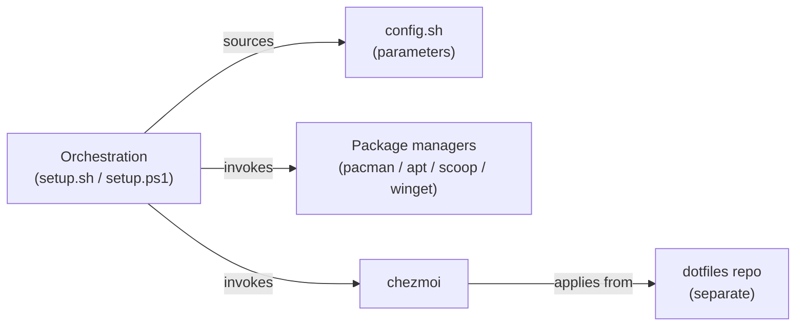
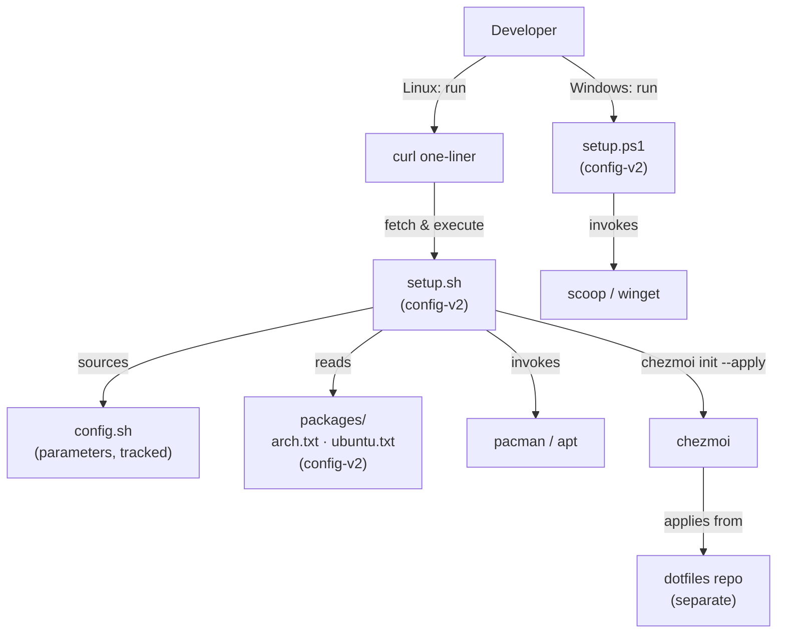
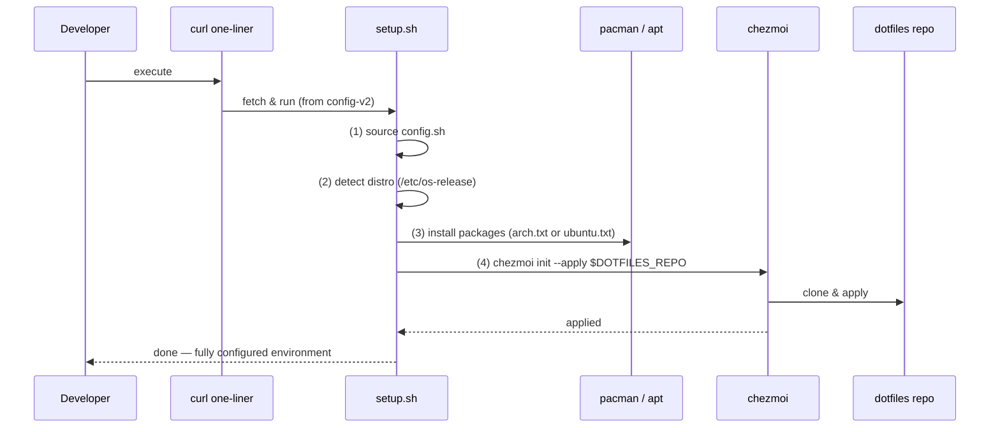

# Architecture Spine — Reproducible Dev Environment Config

## Design Paradigm

**Delegation pipeline.** Bootstrap proceeds in a fixed stage sequence; each stage owns exactly one concern and delegates to the authoritative tool for that concern. Orchestrators call down; they never reimplement what a delegate owns.

```
Stages:
  1. Entry point  → curl one-liner (fetch + execute setup.sh)
  2. Orchestrate  → setup.sh / setup.ps1 (sequence only; own nothing)
  3. Packages     → pacman / apt / scoop / winget (own installs)
  4. Dotfiles     → chezmoi (own user config state, templating, conflict resolution)
```

## Invariants & Rules

### AD-1 — Two-repo boundary [ADOPTED]

- **Binds:** all, structural seed
- **Prevents:** dotfile config leaking into `config-v2`; bootstrap logic appearing in the `dotfiles` repo
- **Rule:** `config-v2` contains only bootstrap scripts (`setup.sh`, `setup.ps1`), package manifests (`packages/`), the parameter file (`config.sh`), and Windows tooling. All user dotfile config lives in the `dotfiles` repo and is applied exclusively by chezmoi. No file managed by chezmoi may reside in `config-v2`.

### AD-2 — Orchestrator delegates, never owns [ADOPTED]

- **Binds:** CAP-1, CAP-2, CAP-4, `setup.sh`, `setup.ps1`
- **Prevents:** setup scripts re-implementing package-install or dotfile-state logic; orchestration-layer bloat
- **Rule:** `setup.sh` and `setup.ps1` invoke their delegates and exit. They must not implement package install/remove (owned by pacman/apt/scoop/winget), dotfile state or conflict resolution (owned by chezmoi), or user-config templating (owned by chezmoi). Any logic that belongs inside a delegate must live there.

### AD-3 — `config.sh` as sole parameter source [ADOPTED]

- **Binds:** CAP-1, CAP-3, CAP-4, `setup.sh`, `setup.ps1`
- **Prevents:** interactive prompts mid-run; hard-coded user values; parameter sources scattered across scripts
- **Rule:** All configurable runtime values (Git identity, GPG fingerprint, dotfiles repo URL, feature flags) are declared in `config.sh` (KEY=value, bash-sourceable). `config.sh` is tracked in git; it must contain only safe public references (GPG fingerprint, usernames, public repo URLs — no secrets, passwords, or private keys). Scripts source `config.sh` at start and read only from it. No script may prompt interactively once `config.sh` is in place.

### AD-4 — Detect-before-mutate for stateful assets [ADOPTED]

- **Binds:** CAP-3, `setup.sh`
- **Prevents:** SSH key or GPG key destruction on re-run; overwriting secrets on an already-configured machine
- **Rule:** Before writing to any stateful user asset (SSH keys, GPG keys, credentials), scripts must test for presence. If present: skip with a log line; do not overwrite. Repo-owned managed files (tracked by chezmoi) are always overwritten on `chezmoi apply`; stateful user assets are never touched if already present.

### AD-5 — Distro dispatch is isolated [ADOPTED]

- **Binds:** CAP-1, `packages/`, `setup.sh`
- **Prevents:** Arch-specific commands running on Ubuntu (or vice versa); distro-detection logic scattered
- **Rule:** `setup.sh` detects the distro once (via `/etc/os-release`) and uses the result to select the correct package manifest and package-manager invocation. All distro-specific commands live inside guarded branches keyed to that result. Shared logic is written distro-agnostically; no distro-specific command appears outside a guarded branch.

### AD-6 — No secrets in repository [ADOPTED]

- **Binds:** all; constraint: public repo
- **Prevents:** accidental credential exposure in a public repository
- **Rule:** No secret, credential, password, or private key may be committed to `config-v2`. Only non-secret references (e.g. GPG fingerprint, username, public repo URLs) are permitted in tracked files. `config.sh` is tracked and follows this rule — all values in it must be safe public references only.

### Dependency direction



No upward dependency is permitted. Delegates must not call back into orchestration scripts.

### AD-7 — Stateful-asset vs. chezmoi-managed boundary [ADOPTED]

- **Binds:** CAP-2, CAP-3, setup.sh, chezmoi, dotfiles repo
- **Prevents:** the same file path being guarded (skip-if-present) by setup.sh and simultaneously always-overwritten by chezmoi, causing non-deterministic machine state depending on execution order
- **Rule:** Every file path that either setup.sh writes or chezmoi manages must be declared in exactly one category: `stateful-asset` (detect-before-mutate, never chezmoi-managed) or `chezmoi-managed` (always-overwritten on apply, never touched by setup.sh). No path may belong to both. The canonical SSH key filename is declared in `config.sh` (`SSH_KEY_FILE`) and referenced identically in setup.sh and any chezmoi dotfile template; `~/.ssh/config` is chezmoi-managed only.

### AD-8 — `config.sh` is the exhaustive canonical key schema [ADOPTED]

- **Binds:** CAP-1, CAP-3, CAP-4, setup.sh, setup.ps1, config.sh
- **Prevents:** setup.sh and setup.ps1 reading the same conceptual value under different key names; silent empty-string failures when a key exists on one platform but not the other
- **Rule:** Every key any script reads must be declared verbatim in `config.sh`. No key may be invented inside a script at runtime. Canonical required keys: `DOTFILES_REPO`, `GIT_USER_NAME`, `GIT_USER_EMAIL`, `GPG_FINGERPRINT`, `SSH_KEY_FILE`. Any new script-read key must first be added to `config.sh`.

### AD-9 — Bootstrap execution order [ADOPTED]

- **Binds:** CAP-1, setup.sh
- **Prevents:** package installs and dotfile application running in an undefined or reversed order, causing chezmoi templates to reference tools not yet installed; prevents setup.sh and a dotfiles `run_once_` script from both owning the bootstrap sequence
- **Rule:** The curl one-liner fetches and executes `setup.sh` from `config-v2`. `setup.sh` is the master orchestrator and runs in this fixed order: (1) source `config.sh`, (2) install packages via the distro package manager, (3) invoke `chezmoi init --apply`. The dotfiles repo must not contain a `run_once_` script that re-triggers package installation or replaces `setup.sh`'s orchestration role.

## Consistency Conventions

| Concern | Convention |
| --- | --- |
| Naming (files) | lowercase, hyphen-separated for script names; distro names match `/etc/os-release` `ID` field (`arch`, `ubuntu`) |
| Package manifests | one package name per line, plaintext; no version pins unless a specific version is required |
| Config format | `config.sh` — `KEY=value` pairs, bash-sourceable; no spaces around `=` |
| Stateful-asset guard | test with `-f`/`-d` before any write to SSH/GPG paths; emit a human-readable skip message |
| Stateful vs. managed boundary | each writable path belongs to exactly one category; declared in AD-7; SSH key file declared in `config.sh` as `SSH_KEY_FILE`; `~/.ssh/config` is chezmoi-managed |
| config.sh key naming | canonical keys in `config.sh` (AD-8); new keys added to `config.sh` before use in any script |
| Managed config | repo-owned files applied by chezmoi are always overwritten; no soft-merge for tracked content |
| Secrets | never committed; `config.sh` is tracked but must contain only safe public references (GPG fingerprint, usernames, public repo URLs); no passwords, credentials, or private keys in any tracked file |

## Stack

| Name | Version |
| --- | --- |
| zsh | latest stable (distro package) |
| chezmoi | latest stable |
| fnm | latest stable |
| zinit | latest stable |
| starship | latest stable |
| zsh-autosuggestions | latest stable |
| zsh-syntax-highlighting | latest stable (`zsh-users/zsh-syntax-highlighting`) |
| fzf-tab | latest stable |
| zoxide | latest stable |
| Docker + Docker Compose | latest stable (distro package) |
| Neovim | latest stable |
| tmux | latest stable |
| Scoop (Windows) | latest stable |
| winget (Windows) | inbox (Windows 11) |

> [ASSUMPTION] All tools installed at latest stable unless a specific version is pinned in the package manifest. No global lockfile in this repo — version pinning is an implementation detail deferred to package manifests and chezmoi config.

## Structural Seed

### System context



### Bootstrap sequence (Linux) — fixed execution order (AD-9)



### Source tree (config-v2)

```text
config-v2/
  setup.sh              # Linux bootstrap orchestrator: source config.sh → install packages → chezmoi init --apply (AD-9)
  setup.ps1             # Windows bootstrap orchestrator (sources config equivalents; delegates to scoop/winget)
  config.sh             # [tracked] sole param source; canonical keys (AD-8): DOTFILES_REPO, GIT_USER_NAME, GIT_USER_EMAIL, GPG_FINGERPRINT, SSH_KEY_FILE — safe public values only (AD-6)
  packages/
    arch.txt            # Arch package manifest (one package per line)
    ubuntu.txt          # Ubuntu package manifest (one package per line)
```

## Capability → Architecture Map

| Capability | Lives in | Governed by |
| --- | --- | --- |
| CAP-1 — fresh Linux bootstrap | `setup.sh` + `packages/` + chezmoi entry | AD-1, AD-2, AD-3, AD-5, AD-8, AD-9 |
| CAP-2 — sync dotfiles across machines | `chezmoi apply` (dotfiles repo) | AD-1, AD-2, AD-7 |
| CAP-3 — idempotent re-run | `setup.sh` detect-before-mutate guards | AD-3, AD-4, AD-7, AD-8 |
| CAP-4 — Windows bootstrap | `setup.ps1` + Scoop/winget | AD-1, AD-2, AD-3, AD-8 |

## Deferred

- **Error handling and logging patterns** — what a failed package install does; whether setup.sh aborts or continues; implementation detail
- **Tool version pinning strategy** — whether specific versions are pinned in manifests or always latest; deferred to package manifest authoring
- **CI pipeline** — scope, triggers, distros covered beyond Ubuntu; SPEC open question, explicitly deferred
- **chezmoi template design** — how variables are templated in dotfiles; lives in the dotfiles repo, outside this spine's scope
- **Per-distro install ordering and retry logic** — script implementation detail
- **YubiKey SSH bridge** — SPEC open question; future evaluation only
- **Mac support** — SPEC non-goal; future evaluation only
- **Windows deep integration** (WSL2 user bootstrap through Linux user creation) — explicit SPEC non-goal
