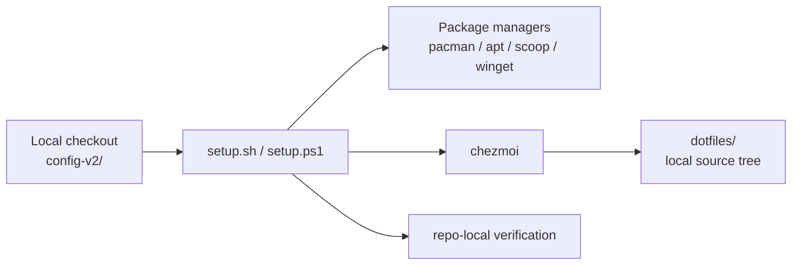
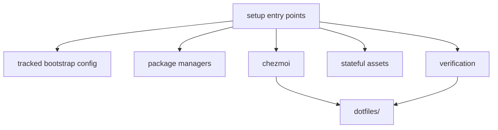
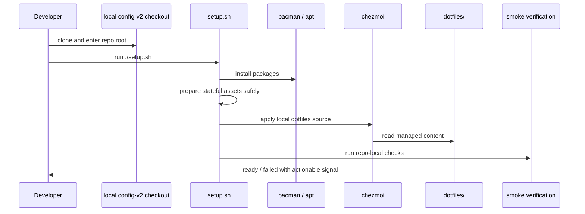

# Architecture Spine — Reproducible Dev Environment Config — In-Repo Dotfiles Integration

## Design Paradigm

**Monorepo delegation pipeline.** One repository contains both bootstrap orchestration and declarative dotfile source, but ownership remains split by concern: orchestrators sequence, package managers install, chezmoi applies managed user config from the local checkout.



## Invariants & Rules

### AD-1 — In-repo dotfiles boundary

- **Binds:** all
- **Prevents:** drift between bootstrap logic and the dotfiles state used for setup-flow testing
- **Rule:** All chezmoi-managed source files live under `config-v2/dotfiles/` and are applied from the local checkout. `setup.sh` must not clone or reference a second dotfiles repository as the supported path.

### AD-2 — Orchestrator delegates, never owns

- **Binds:** `setup.sh`, future `setup.ps1`, CAP-1, CAP-2, CAP-4
- **Prevents:** bootstrap scripts accumulating package definitions, dotfile content, or merge logic that belongs to delegates
- **Rule:** Setup entry points sequence package installation, stateful-asset preparation, local chezmoi apply, and verification only. Package manifests stay in `packages/`; managed user configuration stays in `dotfiles/`; file-state reconciliation for managed content stays in chezmoi.

### AD-3 — Repository-root execution contract

- **Binds:** `setup.sh`, `packages/`, `dotfiles/`, CAP-1
- **Prevents:** entry paths that lack required local content, plus path resolution bugs between orchestration and managed content
- **Rule:** The only supported bootstrap entry point is a local clone of `config-v2` executed from repository root. Setup scripts resolve package manifests and the `dotfiles/` source tree relative to that checkout root.

### AD-4 — Test-fixture safety boundary

- **Binds:** `dotfiles/`, tracked bootstrap configuration, CAP-1, CAP-2, CAP-3
- **Prevents:** personal secrets or machine-unique state making the integrated dotfiles tree unusable for fresh-machine tests
- **Rule:** Tracked content under `dotfiles/` must be safe for repeated end-to-end bootstrap tests in a public repo. No secret, private key, password, or machine-unique credential may be committed. Personal values must be templated, derived from safe tracked defaults, or injected from explicitly local untracked inputs.

### AD-5 — Stateful-asset vs. chezmoi-managed ownership

- **Binds:** `setup.sh`, `dotfiles/`, CAP-2, CAP-3
- **Prevents:** the same path being both guarded as stateful and overwritten as managed content, causing nondeterministic reruns
- **Rule:** Every bootstrap-touched path belongs to exactly one category: `stateful-asset` (detect-before-mutate, never chezmoi-managed) or `chezmoi-managed` (always overwritten on apply, never written directly by setup scripts). No path may belong to both.

### AD-6 — Verification is a first-class stage

- **Binds:** CAP-1, CAP-2, CAP-3, setup flow
- **Prevents:** a green-looking bootstrap run that exits successfully but leaves the machine unusable
- **Rule:** The supported setup flow ends with a repo-local smoke-verification stage that checks the expected package toolchain, key managed files/symlinks, and primary shell/editor entrypoints after chezmoi apply. Verification belongs to the repository and runs against the integrated `dotfiles/` tree.

### AD-7 — Distro dispatch is isolated

> Carried forward from the superseded 2026-08-05 spine (AD-5) by correct-course 2026-10-07.

- **Binds:** CAP-1, `packages/`, `setup.sh`
- **Prevents:** Arch-specific commands running on Ubuntu (or vice versa); distro-detection logic scattered across the script
- **Rule:** `setup.sh` detects the distro once via `/etc/os-release` and uses the result to select the matching package manifest and package-manager invocation. Distro-specific commands live only inside guarded branches keyed to that result; shared logic stays distro-agnostic.

### AD-8 — Bootstrap configuration is the canonical key schema

> Carried forward from the superseded 2026-08-05 spine (AD-3, AD-8) by correct-course 2026-10-07.

- **Binds:** `setup.sh`, `setup.ps1`, `dotfiles/` templates, CAP-1, CAP-3, CAP-4
- **Prevents:** the same conceptual value being read under different names across scripts and templates; silent empty values when a key is missing
- **Rule:** Every value a bootstrap script reads is declared in the configuration block at the top of its entry point. Canonical Linux keys: `GIT_USER_NAME`, `GIT_USER_EMAIL`, `GPG_FINGERPRINT`, `SSH_KEY_FILE`. `DOTFILES_REPO` is removed: the dotfiles source path is derived from the repository root (AD-3), not configured. New keys are declared before use in any script or template. All values must be public-safe (AD-4).

### AD-9 — Bootstrap execution order

> Updated from the superseded 2026-08-05 spine (AD-9) by correct-course 2026-10-07.

- **Binds:** CAP-1, CAP-3, `setup.sh`, `dotfiles/`
- **Prevents:** chezmoi templates referencing tools not yet installed; `dotfiles/` scripts competing with `setup.sh` as orchestrator
- **Rule:** `setup.sh` runs in this fixed order: (1) load the configuration block and resolve the repository root, (2) detect the distro, (3) install packages, (4) prepare stateful assets (detect-before-mutate), (5) `chezmoi apply` from the local `dotfiles/` source, (6) run smoke verification. `dotfiles/` must not contain `run_once_` scripts that install packages or replace `setup.sh` orchestration.

### Dependency direction



No delegate may call back into setup scripts. `dotfiles/` content may assume packages are installed before apply, but may not own package installation itself.

## Consistency Conventions

| Concern | Convention |
| --- | --- |
| Naming (directories and scripts) | lowercase, repo-relative paths; use `dotfiles/` for chezmoi source, `packages/` for manifests, `tests/` for setup verification |
| Managed content layout | all tracked user-config source that chezmoi applies lives under `dotfiles/`; no managed config at repo root except bootstrap docs and setup entry points |
| Config and secrets | tracked config may hold only public-safe defaults or references; any secret-bearing local inputs are untracked and optional |
| Path resolution | setup scripts derive paths from repository root, never from the caller's current directory and never from remote clone URLs |
| Ownership model | package install in package managers; managed config in chezmoi; stateful assets guarded in setup scripts; verification in repo-local test scripts |
| Re-run behavior | rerunning setup is supported; managed content is reapplied, stateful assets are preserved, verification is rerun |

## Structural Seed

### Source tree

```text
config-v2/
  setup.sh                # Linux bootstrap orchestrator
  setup.ps1               # Windows companion bootstrap (deferred for deep dotfiles integration)
  packages/
    arch.txt              # Arch package manifest
    ubuntu.txt            # Ubuntu package manifest
  dotfiles/               # chezmoi source tree applied from the local checkout
  tests/                  # smoke verification for the supported setup flow
  README.md               # local-checkout bootstrap contract
```

### Linux bootstrap sequence



## Capability → Architecture Map

| Capability / Area | Lives in | Governed by |
| --- | --- | --- |
| CAP-1 — fresh Linux bootstrap | `setup.sh`, `packages/`, `dotfiles/`, verification | AD-1, AD-2, AD-3, AD-4, AD-6, AD-7, AD-8, AD-9 |
| CAP-2 — sync dotfiles across machines | `dotfiles/` via chezmoi apply | AD-1, AD-2, AD-5 |
| CAP-3 — idempotent rerun | stateful-asset guards + managed apply + verification | AD-4, AD-5, AD-6, AD-8, AD-9 |
| CAP-4 — Windows companion bootstrap | `setup.ps1` and shared repo layout | AD-2, AD-3, AD-8 |

## Deferred

- **Exact `dotfiles/` internal layout** — flat chezmoi source root vs. nested subfolders can be decided during implementation
- **Migration choreography** — not needed: the former external `HaberkornJonas/dotfiles` repository is empty, so `dotfiles/` starts fresh (correct-course 2026-10-07)
- **Windows deep integration with integrated dotfiles** — keep the shared repo layout, but defer platform-specific mechanics
- **Concrete verification assertions** — exact commands and file checks belong in test design, not the spine
- **Spec and README refresh** — SPEC refreshed by correct-course 2026-10-07; README refresh is Epic 2 Story 2.5
